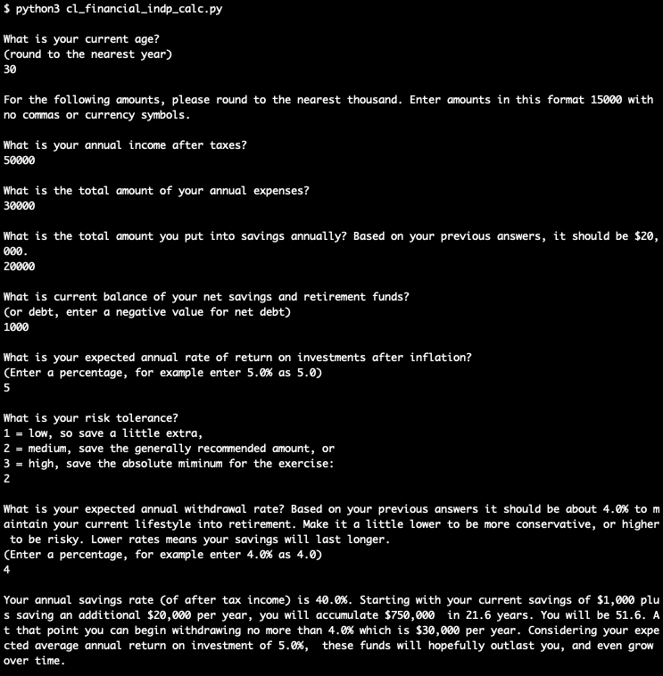

# Uncle Buck

## About
This is a Financial Independence Calculator Full-Stack Web App created for the PSU Open Source class in the Summer 2020 by team "Uncle Buck". The calculator is a toy meant for entertainment purposes by allowing the user play around with some number to see if and when they can reach financial independence.

*Financial Independence* is the status of having enough income (from investments, passive businesses, real estate, etc.) to pay for one's reasonable living expenses for the rest of one's life without having to rely on formal employment. The core path to achieve financial independence focuses on maximizing one's savings rate through lower spending and/or higher income. Checkout some of the resources listed [here](Resources.md) for a lot information about the theory and some ideas on how to achieve financial independence.

**Here is how our calculator works.** 
As mentioned above, reaching the state of financial independence means that your basic expenses are covered from passive income. The passive income can consist of rental income (not really passive, since owning rental property takes work), interest and dividence payments from investments, pension payments, and social security payments. We won't go into the details of if or how you obtain these sources of income here, but check out the [resources](Resources.md) link for more information. The real quick calculator is here. Take your annual expenses, multiple by 25, and **boom**, that's the amount of money you need for financial independence. Now let's talk about why that works. The average long term annual growth rate of the S&P500 (which is commonly used to benchmark stock market investment returns), after adjusting for inflation (btw, we are treating inflation uniformly across our calculations, so we assume that inflation will both increase annual spending and annual investment returns at close to the same amount, and therefore we eliminate them both from our calculation) is [7%](https://www.investopedia.com/ask/answers/042415/what-average-annual-return-sp-500.asp). If you look at shorter periods of time, sometimes the average is lower, so to be safe we're going to use 5% for this example. In other words, let's assume that we can assume that (on average, over long periods of time) that our savings will return 5% per year. Now. Remember that 25 x annual expenses number we mentioned earlier? If you were going to cover your expenses with passive income, then you'd need to withdraw that amount from your savings each year. Well, 1/25th of your savings is 4%. So each year you need to withdraw 4% of your savings, and each year your savings should be growing by 5% (again, on average). So basically by saving 25 times your annual expenses you are setting yourself up such that your savings grows faster than you are spending. This means that barring some extreme scenarios your savings will remain intact longer than you will. Pretty nice! 

There are a few twists in our calculator, for example:
- We set 5% as the default annual rate of return on investments for the same reason mentioned above. You can play around with lower or higher numbers based on your expected investment performance (hot investment tips are welcome, send them to [us](https://github.com/Team-Uncle-Buck)!).
- We give you the option of adjusting the multiple of annual expenses as a savings targer. If you have a low risk tolerance then we suggest you save 30x and if you have a high risk tolerance then we suggest you save 20x. These numbers affect how long your savings may last after you start withdrawing. So if you want to *really* make sure the savings last longer than you, assume a low risk tolerance in the calculator.
- We give you the option of changing your withdrawal rate. As mentioned above, 4% annual withdrawal ratekeeps you just under the conservative long term 5% investment growth rate. You can change this number higher or lower based on your anticipate expenses. For example, maybe you anticipate your expenses dropping when you hit financial independence because you plan on downsizing your home and selling your automobile. In that case, set your withdrawal rate lower. On the other hand, maybe you're going to move into a larger home, or travel a lot. In that case, you'll need to increase your withdrawal rate to reflect the higher spending levels.

Our calculator takes all these numbers into consideration and then predicts (again, assuming no unforseen outstanding circumstances) how long it will take you to accumulate enough funds to become financially independent, and then how long those funds should last you after you start taking withdrawals. There are a few scenarios we don't yet take into account. Most notably, what happens if you reach your financial independence mark but keep working afterwards? Well, in short your savings just grow even moreso than they already would. Maybe in version 2.0 we'll expand the calculator reflect such a scenario.

## **!!!  Disclaimer  !!!**
This tool is meant for entertainment purposes only. We are not financial professionals. We assume no risk or responsibility for your financial affairs, well being, nor do we assume any liability for your decisions. Everybody's financial situation is different, you cannot rely on a single tool for guidance. For real advice on personal finance, find a trusted certified public accountant [CPA](https://account.aicpa.org/eWeb/dynamicpage.aspx?webcode=referralwebsearch) or certified financial planner [CFP](https://www.letsmakeaplan.org/).

## Instructions for Use
There are two methods to accessing this toy tool.
1) Read the supporting documentation linked from this README, and execute the code locally on your machine. You will need at least [Python3](https://www.python.org/downloads/) installed on your machine. Then proceed to the subfolder titled "local_python_version" and run the program with this command: "python3 cl_financial_indp_calc.py" 

2) Visit our website deployed on Heroku: https://uncle-buck.herokuapp.com/
3) I guess option three is to download the web app and run it on your local machine:
   -  first make sure you have [Git](https://git-scm.com/), [ReactJS](https://reactjs.org/), [Node Package Manager](https://www.npmjs.com/) installed on your machine, then execute these commands...
   -  git clone https://github.com/Team-Uncle-Buck/uncle_buck.git
   -  cd uncle_buck\project
   -  npm install
   -  npm start
   -  cd client
   -  npm install
   -  npm start
   -  Then navigate to localhost:3000 (or whatever port React assigns) to view the web app locally.

## Resources
We benefited from the tools, libraries, and tips from many different sources. [Here](Resources.md) is a detailed list of references both technical and domain related. 

## Code of Conduct
[Code of Conduct](CodeOfConduct.md) borrowed from [Contributor Covenant](https://www.contributor-covenant.org/).

## License
This work is released under the "GNU General Public License". Please see the file [LICENSE](LICENSE) in this distribution for license terms.

## [**Team Uncle Buck**](https://github.com/Team-Uncle-Buck)
- [Mi Yon Kim](https://github.com/youn0125)
- [Tom More "$ Less Problems" Lancaster](https://github.com/tlan2)
- [Pat Radamacher](https://github.com/PatRademacher)
- [Chad Tolleson](https://github.com/tollesonpdx)
- [Uncle Buck](https://github.com/Team-Uncle-Buck)
